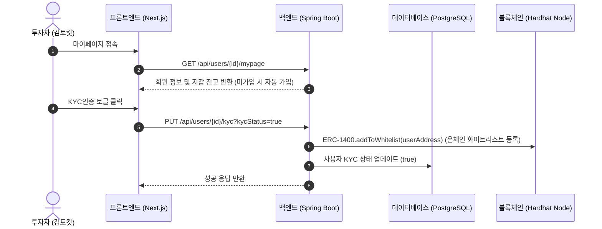
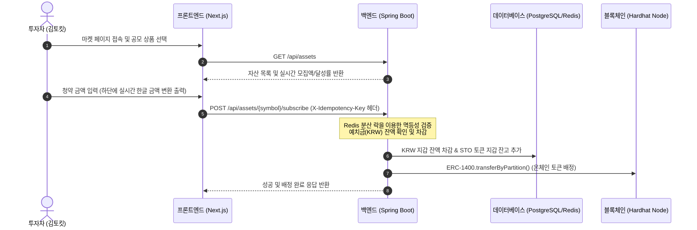
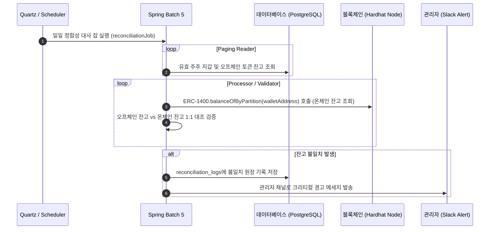

# 🏛️ TOKIT — STO 토큰증권 초고속 매칭 엔진 & 거래소 플랫폼

> **대규모 금융 트래픽 분산 처리**와 **0.1원의 오차도 허용하지 않는 강력한 데이터 정합성**을 보장하는 고성능 토큰증권(STO) 거래 플랫폼의 엔터프라이즈 레퍼런스 모델입니다.

---

## 🎯 1. 프로젝트 비전 및 기술적 지향점 (Core Vision)

### 💡 기술적 당면 과제 (Core Engineering Goal)
- **트랜잭션 동시성 제어**: DB 데드락(Deadlock) 및 핫스팟(Hotspot)을 최소화하는 효율적인 분산 배타 락 적용.
- **초고속 매칭 처리**: 인메모리(Redis)를 응용한 대규모 거래 매칭 알고리즘 구현.
- **실시간 비차단 데이터 스트리밍**: 클라이언트(Next.js) 렌더링 오버헤드를 제어하는 최적화된 SSE/WebSocket 스트림 채널 구축.
- **온-오프체인 정합성 보장**: PostgreSQL 오프체인 잔고 데이터와 블록체인(Hardhat Solidity) 온체인 스마트 컨트랙트 간의 일일 상시 대사(Reconciliation) 파이프라인 수립.
- **대용량 배당 분배 엔진**: Spring Batch 5 및 비관적 락(Pessimistic Lock) 기반으로 수만 명의 STO 주주에게 지분 비율대로 KRW 예치금을 오차(소수점 첫째 자리 절사) 없이 배분하는 대량 결산 배치 아키텍처 수립.

### 💼 비즈니스 아키텍처 (Business Value)
고가의 실물 자산(예: 상업용 부동산, 미술품 등)을 신탁하여 수익증권을 발행하고, 이를 블록체인 기반의 토큰으로 분할 발행(STO)하여 다수의 투자자가 안전하게 공모 청약 및 2차 거래(호가 매칭)를 할 수 있도록 지원하는 초고속 결제 및 매칭 인프라입니다.

### 🔗 블록체인 코어 (ERC-1400 STO Standard)
본 프로젝트는 단순한 데이터베이스 거래소가 아닙니다. 최종 자산의 소유권 증명은 규제 준수형 STO 표준인 **ERC-1400 스마트 컨트랙트**를 통해 관리됩니다.
- **화이트리스트 기반 통제**: KYC 인증을 마친 사용자(지갑)만이 파티션(Partition) 간 토큰 전송 권한을 얻습니다.
- **오프체인 매칭 & 온체인 결산**: 매칭 엔진의 폭발적인 트래픽은 오프체인(PostgreSQL/Redis)에서 처리하고, 체결된 내역은 비동기 워커(`ContractService`)를 통해 온체인 원장으로 동기화(Reconciliation)되어 영구적으로 박제됩니다.

---

## 📐 2. 아키텍처 및 역할 정의 (Tech Stack & R&R)

```text
┌──────────────┐      WebSocket/SSE      ┌─────────────────────────┐
│   Frontend   │ ◄─────────────────────► │       Backend           │
│  (Next.js)   │       REST API          │     (Spring Boot)       │
└──────────────┘                         └───────────┬─────────────┘
                                                     │
                             ┌───────────────────────┼─────────────────────────┐
                             │                       │                         │
                      ┌──────▼──────┐        ┌───────▼───────┐        ┌────────▼────────┐
                      │ PostgreSQL  │        │     Redis     │        │    RabbitMQ     │
                      │ (오프체인 원장) │        │ (호가/분산락)   │        │   (이벤트 큐)     │
                      └──────┬──────┘        └───────────────┘        └────────┬────────┘
                             │                                                 │
                             │                                        ┌────────▼────────┐
                             │                                        │ Matching Engine │
                             │                                        └────────┬────────┘
                             │                                                 │
                    ┌────────▼─────────────────────────────────────────────────▼────────┐
                    │               비동기 Web3j Worker / Reconciliation Batch                │
                    └────────────────────────────────┬──────────────────────────────────┘
                                                     │ (On-Chain Settlement)
                                            ┌────────▼────────┐
                                            │   Blockchain    │
                                            │ (Hardhat Node)  │
                                            │   [ERC-1400]    │
                                            └─────────────────┘
```

| 레이어 | 기술 스택 | 핵심 역할 및 책임 (R&R) |
| :--- | :--- | :--- |
| **Frontend** | Next.js 16 (App Router), TS, Tailwind, Zustand | **"Dumb Client"**. 가공되지 않은 상태(State)의 렌더링에만 집중하며, 중복 클릭 방지 등 클라이언트 측 멱등성 UI를 구현합니다. |
| **Backend** | Java 25 (LTS), Spring Boot 4.0, JPA, WebSocket | **"The Brain"**. 비즈니스 로직 제어, 트랜잭션 격리수준 관리, 인메모리 매칭 엔진 구동 및 실시간 데이터 푸시를 비차단(Non-blocking)으로 수행합니다. |
| **Database** | PostgreSQL 17 | **"Source of Truth"**. 모든 자산 거래 원장(Ledger)과 회원 정보가 엄격한 무결성 하에 보존되는 유일한 물리 저장소입니다. |
| **Cache & MQ** | Redis 7, RabbitMQ 4 | **"Shock Absorber"**. 초당 수만 건의 트래픽 스파이크를 흡수하고, 매칭 파이프라인의 결합도를 낮추는 버퍼 역할을 담당합니다. |
| **Blockchain** | Hardhat, Solidity 0.8.28 (ERC-1400) | **"Final Ledger"**. 오프체인의 비동기 온체인 동기화 워커에 의해 호출되며, 화이트리스트 및 파티션 전송을 통해 법적 컴플라이언스를 최종 보장합니다. |

---

## 🔄 3. 스택 간 싱크 및 개발 규칙 (Cross-Stack Sync Rules)

아키텍처 붕괴 방지를 위해 아래 3가지 개발 대원칙을 엄격하게 고수합니다.

### 1) API Contract First (계약 우선 개발)
- 백엔드 개발 전에 무조건 JSON 응답 구조(`ApiResponse<T>`)를 확정합니다.
- 프론트엔드는 확정된 계약서(명세)를 기반으로 Mock 데이터를 만들어 UI 바인딩과 상태 관리(Zustand)를 먼저 완성합니다.

### 2) Event-Driven Sync (이벤트 기반 동기화)
- 체결 발생 시 즉각 DB를 업데이트하지 않고 비동기 결합 파이프라인을 탑재합니다.
- `[체결 완료]` $\rightarrow$ 백엔드 PostgreSQL 반영 $\rightarrow$ RabbitMQ에 `Trade_Success` 이벤트 발행.
  1. **WebSocket Worker**: 이벤트를 수신하여 Next.js 클라이언트로 실시간 호가 및 시세 갱신 푸시.
  2. **Web3j Worker**: 이벤트를 수신하여 Hardhat 블록체인 노드로의 ERC-1400 전송 트랜잭션 실행.

### 3) 멱등성 (Idempotency) 보장
- 중복 주문/연타로 인한 사고 방지를 위해 프론트엔드는 주문 전송 시 UUID 기반의 `X-Idempotency-Key`를 HTTP 헤더에 실어 보냅니다.
- 백엔드는 Redis 분산 락 및 키 조회를 통해 중복 요청을 원천 차단하여 **이중 결제를 차단**합니다.

---

## 🔄 4. 플랫폼 핵심 비즈니스 흐름 (Core Platform Flows)

TOKIT STO 플랫폼은 온-오프체인 데이터의 정합성을 보장하며 크게 3가지 비즈니스 플로우로 작동합니다.

### 1) 회원가입 및 KYC 화이트리스트 등록

- **화이트리스트 통제**: 블록체인 온체인 상의 자산 이동은 화이트리스트에 등록된 지갑 주소 간에만 승인되므로, 오프체인 KYC 인증 성공 시 즉시 스마트 컨트랙트의 `addToWhitelist` 함수를 동기적으로 호출하여 온체인 규제를 준수합니다.

### 2) 공모 청약 신청 (Primary Market)

- **멱등성 및 온-오프체인 정합성**: 사용자의 이중 결제 방지를 위해 API 요청 헤더에 멱등성 키(`X-Idempotency-Key`)를 필수 포함하고, 예치금 차감 완료 즉시 블록체인의 `transferByPartition` 함수를 실행하여 온체인 증권 배정을 즉시 결산합니다.

### 3) 상장 자산 실시간 거래 (Secondary Market)
```mermaid
sequenceDiagram
    autonumber
    actor User as 투자자
    participant FE as 프론트엔드 (Next.js)
    participant BE as 백엔드 (Spring Boot)
    participant DB as 데이터베이스 (PostgreSQL/Redis)
    participant MQ as RabbitMQ / 매칭 엔진

    FE->>BE: GET /api/trades/asset/{symbol} (최근 체결 조회)
    FE->>BE: STOMP WebSocket 및 SSE 연결 구독
    User->>FE: 매수 / 매도 주문 제출 (지정가/시장가)
    FE->>BE: POST /api/orders (X-Idempotency-Key 헤더)
    BE->>DB: 주문 접수 및 잔고 홀딩(Lock) 처리
    BE->>MQ: Order_Placed 이벤트 발행 및 매칭 엔진 처리
    Note over MQ: 매칭 완료 시 Trade_Success 이벤트 발행
    MQ->>BE: 체결 정보 전송 및 DB 반영
    BE->>FE: WebSocket/SSE 브로드캐스팅 (호가창 및 체결 갱신)

### 4) 배당금 자동 계산 및 원화 분배 배치 흐름 (Spring Batch 5)
```mermaid
sequenceDiagram
    autonumber
    actor Admin as 관리자
    participant FE as 프론트엔드 (Next.js)
    participant BE as 백엔드 (Spring Boot)
    participant Batch as Spring Batch 5
    participant DB as 데이터베이스 (PostgreSQL)

    Admin->>FE: 특정 STO 배당 재원 입력 및 분배 실행
    FE->>BE: POST /api/admin/dividends (X-Idempotency-Key 헤더)
    Note over BE: DividendPayout 마스터 로그 생성 (status: RUNNING)
    BE-->>FE: 비동기 처리 응답 반환 (200 OK)
    BE->>Batch: dividendPayoutJob 비동기 실행 (CompletableFuture)
    loop Paging Reader (Chunk Size: 10)
        Batch->>DB: 해당 STO 보유한 주주 지갑 페이징 조회
        Batch->>Batch: 지분율(보유량 / 총발행량) 계산 및 배당금 산출 (원화 첫째자리 절사)
        Batch->>DB: 주주 KRW 지갑 비관적 배타 락 (FOR UPDATE) 획득 및 배당금 증액
        Batch->>DB: DividendPayoutDetail 상세 로그 영속화 (status: SUCCESS)
    end
    Batch->>DB: DividendPayout 마스터 상태 COMPLETED 변경
    FE->>BE: GET /api/admin/dividends/{payoutId}/details (배치 결과 실시간 조회)
    BE-->>FE: 상세 분배 현황 반환 (지분율, 지급 금액 등)
```
- **데이터 정합성 및 동시성 방어**: 다수의 주주 지갑에 예치금을 일괄 입금하는 동안 발생할 수 있는 동시 충전/출금 이슈를 예방하기 위해, 각 주주의 KRW 지갑을 비관적 배타 락(`PESSIMISTIC_WRITE`)으로 잠금 처리한 후 입금 트랜잭션을 실행합니다.

### 5) 온-오프체인 데이터 대사 배치 흐름 (Reconciliation Batch)

- **0.1원의 오차 없는 신뢰 보장**: 매 영업일 정해진 스케줄러에 따라 오프체인 RDBMS 잔액과 블록체인 온체인 컨트랙트 원장을 상호 대조하며, 불일치가 발견되면 즉시 관리자 채널에 긴급 알림을 전송하여 온-오프체인 데이터 싱크 무결성을 유지합니다.

- **실시간 비차단 결합**: 거래소 화면 진입 시 STOMP WebSocket (`ws-tokit`) 채널과 SSE (`/api/trades/subscribe/{symbol}`)를 동시 구독하여, 초고속 오프체인 매칭 엔진에서 연산된 체결 및 호가 정보를 화면에 실시간으로 반영합니다.

---

## 📊 5. 프로젝트 개발 현황 (PM 개발 진척도)

현재 플랫폼의 비즈니스 기능 및 기술 레이어별 개발 완료율은 평균 **97%** 수준으로, 실거래 시뮬레이션 및 부하 테스트가 가능한 상태입니다. 

자세한 로드맵, 컴포넌트별 세부 상태 및 검증 결과는 [PM 개발 진척도 보고서](file:///Users/juhee/.gemini/antigravity-ide/brain/e8203c14-2c0a-40a2-9d0d-43181b7ba097/pm_progress_report.md) 문서를 통해 확인하실 수 있습니다.

### 핵심 기능 구현 상태 요약
- **ERC-1400 온체인 규제 (95%)**: KYC 상태 변경에 따른 스마트 컨트랙트 화이트리스트 자동 동기화.
- **예치금 멱등성 및 동시성 (100%)**: Redis 분산 락 및 PostgreSQL 비관적 락을 결합해 0.1원의 오차 없는 안전한 이중 결제 방지 구현.
- **공모 청약 모듈 (100%)**: 자산 모집 실시간 달성률 표시, 최소 청약 금액 유효성 필터링 및 청약 완료 후 즉시 온체인 자산 배정.
- **실시간 호가 및 체결 거래소 (90%)**: STOMP WebSocket 호가판 및 SSE 체결 내역 결합 완료.
- **매칭 엔진 동시성 고하중 검증 (100%)**: 다중 스레드 하의 비동기 RabbitMQ 매칭 시 proxy 지연로딩 예외 극복 및 정합성 테스트 성공.
- **배당금 자동 계산 및 지급 배치 엔진 (100%)**: Spring Batch 5 Chunk 지향 처리를 통한 대용량 주주 지분 배당 분배, 비관적 락을 통한 예치금 증액 정합성 확보 및 어드민 대시보드 UI 연동 완료.

---

## 🚀 6. Quick Start

### Prerequisites
- Java 25 (LTS)
- Node.js 24 (LTS)
- Docker & Docker Compose

### 1. 인프라 기동
```bash
docker compose up -d
```
자세한 Docker 설치, 모니터링 및 트러블슈팅 가이드는 [Docker 인프라 구축 및 가이드북](file:///Users/juhee/IdeaProjects/TOKIT/docs/docker_setup.md) 문서를 참고하십시오.

### 2. Backend 실행
```bash
cd backend
# Gradle Wrapper 로드를 위해 최초 1회 빌드 혹은 IDE에서 프로젝트 임포트
# IDE에서 com.tokit.TokitApplication 실행
```
> 서버: http://localhost:8080
> Swagger API 문서: http://localhost:8080/swagger-ui/index.html

### 3. Frontend 실행
```bash
cd frontend
npm install
npm run dev
```
> 클라이언트: http://localhost:3000

### 4. Blockchain 로컬 노드 기동
```bash
cd blockchain
npm install
npx hardhat node
```
> 로컬 노드: http://localhost:8545

---

## 📄 License
MIT License
