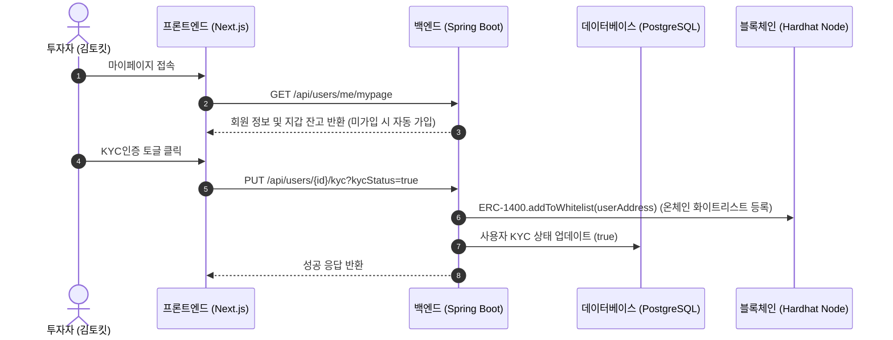
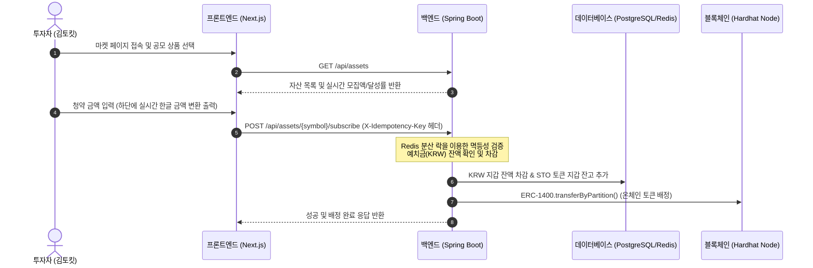
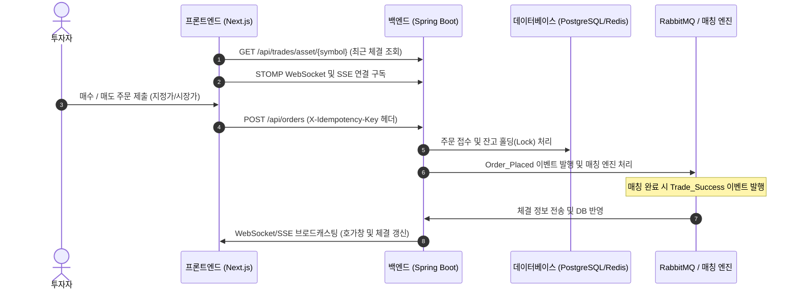
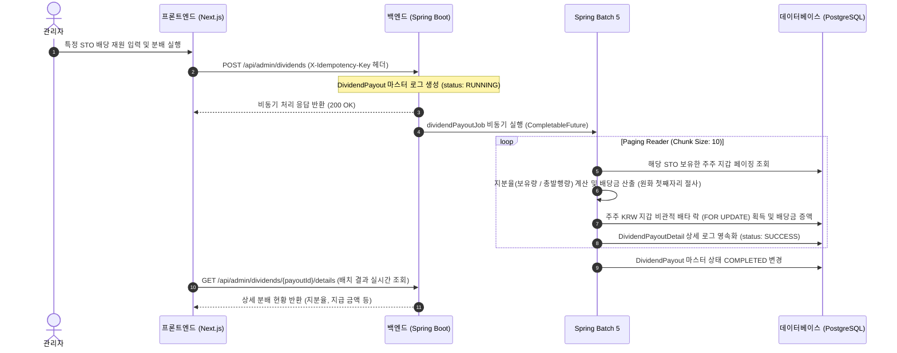
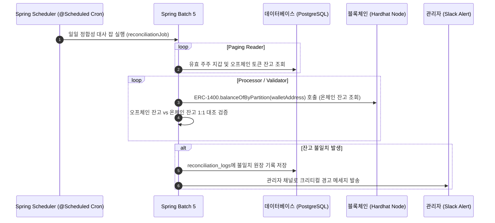

# 🏛️ TOKIT — STO 토큰증권 매칭 엔진 & 거래소 플랫폼

> 호가 매칭·정산·온체인 결산을 다루는 토큰증권(STO) 거래 플랫폼입니다.
> **동시 주문 상황에서 원화와 토큰의 총량이 보존되는가**를 이 프로젝트의 제1 기준으로 삼고,
> 그 불변식을 자동 테스트로 검증합니다.

[]()
[]()


---

## 🎯 1. 프로젝트 비전 및 기술적 지향점 (Core Vision)

### 💡 기술적 당면 과제 (Core Engineering Goal)
- **매칭 경합 제어**: 매칭은 "활성 주문 조회 → 체결 수량 계산 → 잔량 갱신"의 read-modify-write이므로, 종목(Asset) 행에 `PESSIMISTIC_WRITE` 락을 잡아 같은 종목의 매칭을 직렬화. 락 단위가 종목이라 서로 다른 종목은 그대로 병렬 처리됩니다. ([해결 과정 →](#-5-동시성-문제-해결-과정-concurrency-deep-dive))
- **주문 매칭 파이프라인**: 주문 접수는 REST로 받되 매칭은 RabbitMQ 컨슈머에서 비동기로 처리해 API 응답과 체결 연산을 분리. 체결된 호가창 스냅샷은 Redis에 캐시하고 STOMP로 브로드캐스트합니다.
- **실시간 비차단 데이터 스트리밍**: 체결 내역은 SSE, 호가창은 STOMP WebSocket으로 분리해 전송하는 스트림 채널 구축.
- **온-오프체인 정합성 보장**: PostgreSQL 오프체인 잔고 데이터와 블록체인(Hardhat Solidity) 온체인 스마트 컨트랙트 간의 일일 상시 대사(Reconciliation) 파이프라인 수립.
- **대용량 배당 분배 엔진**: Spring Batch 5 및 비관적 락(Pessimistic Lock) 기반으로 다수의 STO 주주에게 지분 비율대로 KRW 예치금을 오차(소수점 첫째 자리 절사) 없이 배분하는 대량 결산 배치 아키텍처 수립.

### 💼 비즈니스 아키텍처 (Business Value)
고가의 실물 자산(예: 상업용 부동산, 미술품 등)을 신탁하여 수익증권을 발행하고, 이를 블록체인 기반의 토큰으로 분할 발행(STO)하여 다수의 투자자가 안전하게 공모 청약 및 2차 거래(호가 매칭)를 할 수 있도록 지원하는 결제 및 매칭 인프라입니다.

### 🔗 블록체인 코어 (ERC-1400 STO Standard)
본 프로젝트는 단순한 데이터베이스 거래소가 아닙니다. 최종 자산의 소유권 증명은 규제 준수형 STO 표준인 **ERC-1400 스마트 컨트랙트**를 통해 관리됩니다.
- **화이트리스트 기반 통제**: KYC 인증을 마친 사용자(지갑)만이 파티션(Partition) 간 토큰 전송 권한을 얻습니다.
- **오프체인 매칭 & 온체인 결산**: 매칭 엔진의 폭발적인 트래픽은 오프체인(PostgreSQL/Redis)에서 처리하고, 체결된 내역은 비동기 워커(`ContractService`)를 통해 온체인 원장으로 동기화(Reconciliation)되어 영구적으로 박제됩니다.

---

## 📐 2. 아키텍처 및 역할 정의 (Tech Stack & R&R)

```text
┌──────────────┐      WebSocket/SSE      ┌─────────────────────────┐
│   Frontend   │ ◄─────────────────────► │       Backend           │
│  (Next.js)   │       REST API          │     (Spring Boot)       │
└──────────────┘                         └───────────┬─────────────┘
                                                     │
                             ┌───────────────────────┼─────────────────────────┐
                             │                       │                         │
                      ┌──────▼──────┐        ┌───────▼───────┐        ┌────────▼────────┐
                      │ PostgreSQL  │        │     Redis     │        │    RabbitMQ     │
                      │ (오프체인 원장) │        │ (호가/멱등성락) │        │   (이벤트 큐)     │
                      └──────┬──────┘        └───────────────┘        └────────┬────────┘
                             │                                                 │
                             │                                        ┌────────▼────────┐
                             │                                        │ Matching Engine │
                             │                                        └────────┬────────┘
                             │                                                 │
                    ┌────────▼─────────────────────────────────────────────────▼────────┐
                    │               비동기 Web3j Worker / Reconciliation Batch                │
                    └────────────────────────────────┬──────────────────────────────────┘
                                                     │ (On-Chain Settlement)
                                            ┌────────▼────────┐
                                            │   Blockchain    │
                                            │ (Hardhat Node)  │
                                            │   [ERC-1400]    │
                                            └─────────────────┘
```

| 레이어 | 기술 스택 | 핵심 역할 및 책임 (R&R) |
| :--- | :--- | :--- |
| **Frontend** | Next.js 16 (App Router), TS, Tailwind, Zustand | **"Dumb Client"**. 가공되지 않은 상태(State)의 렌더링에만 집중하며, 중복 클릭 방지 등 클라이언트 측 멱등성 UI를 구현합니다. |
| **Backend** | Java 25 (LTS), Spring Boot 4.0, JPA, WebSocket | **"The Brain"**. 비즈니스 로직 제어, 트랜잭션 경계 및 락 관리, 매칭 엔진 구동, 실시간 데이터 푸시를 담당합니다. |
| **Database** | PostgreSQL 17 | **"Source of Truth"**. 모든 자산 거래 원장(Ledger)과 회원 정보가 엄격한 무결성 하에 보존되는 유일한 물리 저장소입니다. |
| **Cache & MQ** | Redis 7, RabbitMQ 4 | **"Shock Absorber"**. 주문 접수와 매칭 연산을 큐로 분리해 결합도를 낮추고, 호가창 스냅샷을 캐시해 조회 부하를 흡수합니다. |
| **Blockchain** | Hardhat, Solidity 0.8.28 (ERC-1400) | **"Final Ledger"**. 오프체인의 비동기 온체인 동기화 워커에 의해 호출되며, 화이트리스트 및 파티션 전송을 통해 법적 컴플라이언스를 최종 보장합니다. |

---

## 🔄 3. 스택 간 싱크 및 개발 규칙 (Cross-Stack Sync Rules)

아키텍처 붕괴 방지를 위해 아래 3가지 개발 대원칙을 엄격하게 고수합니다.

### 1) API Contract First (계약 우선 개발)
- 백엔드 개발 전에 무조건 JSON 응답 구조(`ApiResponse<T>`)를 확정합니다.
- 프론트엔드는 확정된 계약서(명세)를 기반으로 Mock 데이터를 만들어 UI 바인딩과 상태 관리(Zustand)를 먼저 완성합니다.

### 2) Event-Driven Sync (이벤트 기반 동기화)
- 체결 발생 시 즉각 DB를 업데이트하지 않고 비동기 결합 파이프라인을 탑재합니다.
- `[체결 완료]` $\rightarrow$ 백엔드 PostgreSQL 반영 $\rightarrow$ RabbitMQ에 `Trade_Success` 이벤트 발행.
  1. **WebSocket Worker**: 이벤트를 수신하여 Next.js 클라이언트로 실시간 호가 및 시세 갱신 푸시.
  2. **Web3j Worker**: 이벤트를 수신하여 Hardhat 블록체인 노드로의 ERC-1400 전송 트랜잭션 실행.

### 3) 멱등성 (Idempotency) 보장
- 중복 주문/연타로 인한 사고 방지를 위해 프론트엔드는 주문 전송 시 UUID 기반의 `X-Idempotency-Key`를 HTTP 헤더에 실어 보냅니다.
- 백엔드는 Redis `SETNX`(TTL 120초) 기반 선점으로 중복 요청을 차단해 **이중 결제를 막습니다**.
- 단, 이 Redis 락은 **멱등성 전용**입니다. 매칭 경합은 성격이 달라 DB 행 락으로 처리하며,
  그 이유는 [5장 3절](#-5-동시성-문제-해결-과정-concurrency-deep-dive)에 적었습니다.

---

## 🔄 4. 플랫폼 핵심 비즈니스 흐름 (Core Platform Flows)

TOKIT STO 플랫폼은 온-오프체인 데이터의 정합성을 보장하며 크게 3가지 비즈니스 플로우로 작동합니다.

### 1) 회원가입 및 KYC 화이트리스트 등록

```mermaid
sequenceDiagram
    autonumber
    actor User as 투자자 (김토킷)
    participant FE as 프론트엔드 (Next.js)
    participant BE as 백엔드 (Spring Boot)
    participant DB as 데이터베이스 (PostgreSQL)
    participant BC as 블록체인 (Hardhat Node)

    User->>FE: 마이페이지 접속
    FE->>BE: GET /api/users/me/mypage
    BE-->>FE: 회원 정보 및 지갑 잔고 반환 (미가입 시 자동 가입)
    User->>FE: KYC인증 토글 클릭
    FE->>BE: PUT /api/users/{id}/kyc?kycStatus=true
    BE->>BC: ERC-1400.addToWhitelist(userAddress) (온체인 화이트리스트 등록)
    BE->>DB: 사용자 KYC 상태 업데이트 (true)
    BE-->>FE: 성공 응답 반환
```
- **화이트리스트 통제**: 블록체인 온체인 상의 자산 이동은 화이트리스트에 등록된 지갑 주소 간에만 승인되므로, 오프체인 KYC 인증 성공 시 즉시 스마트 컨트랙트의 `addToWhitelist` 함수를 동기적으로 호출하여 온체인 규제를 준수합니다.

### 2) 공모 청약 신청 (Primary Market)

```mermaid
sequenceDiagram
    autonumber
    actor User as 투자자 (김토킷)
    participant FE as 프론트엔드 (Next.js)
    participant BE as 백엔드 (Spring Boot)
    participant DB as 데이터베이스 (PostgreSQL/Redis)
    participant BC as 블록체인 (Hardhat Node)

    User->>FE: 마켓 페이지 접속 및 공모 상품 선택
    FE->>BE: GET /api/assets
    BE-->>FE: 자산 목록 및 실시간 모집액/달성률 반환
    User->>FE: 청약 금액 입력 (하단에 실시간 한글 금액 변환 출력)
    FE->>BE: POST /api/assets/{symbol}/subscribe (X-Idempotency-Key 헤더)
    Note over BE: Redis 분산 락을 이용한 멱등성 검증<br/>예치금(KRW) 잔액 확인 및 차감
    BE->>DB: KRW 지갑 잔액 차감 & STO 토큰 지갑 잔고 추가
    BE->>BC: ERC-1400.transferByPartition() (온체인 토큰 배정)
    BE-->>FE: 성공 및 배정 완료 응답 반환
```
- **멱등성 및 온-오프체인 정합성**: 사용자의 이중 결제 방지를 위해 API 요청 헤더에 멱등성 키(`X-Idempotency-Key`)를 필수 포함하고, 예치금 차감 완료 즉시 블록체인의 `transferByPartition` 함수를 실행하여 온체인 증권 배정을 즉시 결산합니다.

### 3) 상장 자산 실시간 거래 (Secondary Market)

```mermaid
sequenceDiagram
    autonumber
    actor User as 투자자
    participant FE as 프론트엔드 (Next.js)
    participant BE as 백엔드 (Spring Boot)
    participant DB as 데이터베이스 (PostgreSQL/Redis)
    participant MQ as RabbitMQ / 매칭 엔진

    FE->>BE: GET /api/trades/asset/{symbol} (최근 체결 조회)
    FE->>BE: STOMP WebSocket 및 SSE 연결 구독
    User->>FE: 매수 / 매도 주문 제출 (지정가/시장가)
    FE->>BE: POST /api/orders (X-Idempotency-Key 헤더)
    BE->>DB: 주문 접수 및 잔고 홀딩(Lock) 처리
    BE->>MQ: Order_Placed 이벤트 발행 및 매칭 엔진 처리
    Note over MQ: 매칭 완료 시 Trade_Success 이벤트 발행
    MQ->>BE: 체결 정보 전송 및 DB 반영
    BE->>FE: WebSocket/SSE 브로드캐스팅 (호가창 및 체결 갱신)
```
- **소유권 검증 및 잔고 반환**: 주문 취소는 반드시 주문 소유자 본인만 요청할 수 있도록 검증하며, 취소 시점의 미체결 잔량만큼만 정확히 홀딩 해제하여 예치금/자산 잔고를 되돌립니다. 이미 체결 완료(FILLED)되었거나 취소된 주문의 재취소는 차단됩니다.

### 4) 배당금 자동 계산 및 원화 분배 배치 흐름 (Spring Batch 5)

```mermaid
sequenceDiagram
    autonumber
    actor Admin as 관리자
    participant FE as 프론트엔드 (Next.js)
    participant BE as 백엔드 (Spring Boot)
    participant Batch as Spring Batch 5
    participant DB as 데이터베이스 (PostgreSQL)

    Admin->>FE: 특정 STO 배당 재원 입력 및 분배 실행
    FE->>BE: POST /api/admin/dividends (X-Idempotency-Key 헤더)
    Note over BE: DividendPayout 마스터 로그 생성 (status: RUNNING)
    BE-->>FE: 비동기 처리 응답 반환 (200 OK)
    BE->>Batch: dividendPayoutJob 비동기 실행 (CompletableFuture)
    loop Paging Reader (Chunk Size: 10)
        Batch->>DB: 해당 STO 보유한 주주 지갑 페이징 조회
        Batch->>Batch: 지분율(보유량 / 총발행량) 계산 및 배당금 산출 (원화 첫째자리 절사)
        Batch->>DB: 주주 KRW 지갑 비관적 배타 락 (FOR UPDATE) 획득 및 배당금 증액
        Batch->>DB: DividendPayoutDetail 상세 로그 영속화 (status: SUCCESS)
    end
    Batch->>DB: DividendPayout 마스터 상태 COMPLETED 변경
    FE->>BE: GET /api/admin/dividends/{payoutId}/details (배치 결과 실시간 조회)
    BE-->>FE: 상세 분배 현황 반환 (지분율, 지급 금액 등)
```
- **데이터 정합성 및 동시성 방어**: 다수의 주주 지갑에 예치금을 일괄 입금하는 동안 발생할 수 있는 동시 충전/출금 이슈를 예방하기 위해, 각 주주의 KRW 지갑을 비관적 배타 락(`PESSIMISTIC_WRITE`)으로 잠금 처리한 후 입금 트랜잭션을 실행합니다.

### 5) 온-오프체인 데이터 대사 배치 흐름 (Reconciliation Batch)

```mermaid
sequenceDiagram
    autonumber
    participant Scheduler as Spring Scheduler (@Scheduled Cron)
    participant Batch as Spring Batch 5
    participant DB as 데이터베이스 (PostgreSQL)
    participant BC as 블록체인 (Hardhat Node)
    participant Slack as 관리자 (Slack Alert)

    Scheduler->>Batch: 일일 정합성 대사 잡 실행 (reconciliationJob)
    loop Paging Reader
        Batch->>DB: 유효 주주 지갑 및 오프체인 토큰 잔고 조회
    end
    loop Processor / Validator
        Batch->>BC: ERC-1400.balanceOfByPartition(walletAddress) 호출 (온체인 잔고 조회)
        Batch->>Batch: 오프체인 잔고 vs 온체인 잔고 1:1 대조 검증
    end
    alt 잔고 불일치 발생
        Batch->>DB: reconciliation_logs에 불일치 원장 기록 저장
        Batch->>Slack: 관리자 채널로 크리티컬 경고 메세지 발송
    end
```
- **온-오프체인 잔고 대사**: 매 영업일 정해진 스케줄러에 따라 오프체인 RDBMS 잔액과 블록체인 온체인 컨트랙트 원장을 상호 대조하며, 불일치가 발견되면 즉시 관리자 채널에 긴급 알림을 전송합니다. *(스케줄러 동작은 단위 테스트로 검증했으나, 대량 데이터 기준 대사 정확도 검증은 미실시)*

- **실시간 비차단 결합**: 거래소 화면 진입 시 STOMP WebSocket (`ws-tokit`) 채널과 SSE (`/api/trades/subscribe/{symbol}`)를 동시 구독하여, 오프체인 매칭 엔진에서 연산된 체결 및 호가 정보를 화면에 실시간으로 반영합니다.

---

## 🔍 5. 동시성 문제 해결 과정 (Concurrency Deep Dive)

> 이 프로젝트에서 가장 깊게 판 문제입니다. **"안전해 보였지만 실은 안전하지 않았던"** 매칭 엔진을
> 테스트로 무너뜨리고 고친 과정을 기록합니다.

### 1) 발견: 안전성이 코드가 아니라 배포 형태에 의존하고 있었다

매칭은 `MatchingService.matchOrder()`에서 **활성 주문 조회 → 체결 수량 계산 → 잔량 갱신** 순으로
진행되는 전형적인 read-modify-write입니다. 그런데 이 구간에 어떤 배타 제어도 없었습니다.

그럼에도 동시성 테스트가 통과했던 이유는 `spring.rabbitmq.listener.simple.concurrency`의
**기본값이 1**이라, 큐 컨슈머 한 개가 매칭을 암묵적으로 직렬화하고 있었기 때문입니다.
즉 정합성이 락이 아니라 **"컨슈머가 하나뿐"이라는 배포 형태**에 기대고 있었고,
컨슈머를 늘리거나 인스턴스를 다중화하는 순간 무너지는 구조였습니다.

### 2) 재현: 애플리케이션 코드는 그대로 두고 가정만 깬다

[`MatchingRaceConditionTest`](backend/src/test/java/com/tokit/domain/matching/service/MatchingRaceConditionTest.java)는
리스너 동시성만 8로 올려 그 가정을 무너뜨립니다. 시나리오는 단순합니다.

- 매도자 1명이 시장의 **전체 공급량 10토큰**을 보유하고 매도 주문 1건을 낸다
- 매수자 10명이 **동시에** 매수 주문을 제출한다 (수요 ≫ 공급)

검증하는 것은 특정 시나리오가 아니라 **불변식**입니다.

| 불변식 | 락 없음 | 락 적용 |
| :--- | ---: | ---: |
| 체결 총량 (≤ 공급량 10) | **80 토큰** | 10 토큰 |
| 매도자 홀딩 잔고 (≥ 0) | **−70** | 0 |
| 지갑 토큰 총량 보존 | 깨짐 | 유지 |

**공급량이 10개인데 80개가 팔렸습니다.** 8배는 우연이 아닙니다 — 컨슈머 스레드 8개가 각각
같은 매도 주문을 중복 체결한 결과로, 동시성 설정값과 정확히 일치합니다.
존재하지 않는 토큰 70개가 시장에 생겨난 것입니다.

### 3) 해결: 매칭 경합에는 왜 애플리케이션 락이 아니라 DB 행 락인가

```java
// MatchingService.matchOrder() 진입부
assetRepository.findBySymbolForUpdate(incomingOrder.getAssetSymbol())
```

종목(Asset) 행에 `PESSIMISTIC_WRITE` 락을 잡아 **같은 종목의 매칭만** 직렬화합니다.

멱등성에는 Redis 락을 쓰면서 여기에는 쓰지 않은 이유는 **락의 수명** 때문입니다.
멱등성은 "요청이 이미 들어왔는가"만 보면 되지만, 매칭은 커밋된 잔량을 읽어야 합니다.
애플리케이션 락은 메서드가 끝날 때 해제되는데 그 시점은 **트랜잭션 커밋 이전**입니다.
락을 놓은 직후 다른 스레드가 아직 커밋되지 않은 잔량을 읽는 창이 남습니다.
DB 행 락은 수명이 커밋 시점과 정확히 일치하므로 그 창이 존재하지 않습니다.

락 단위가 종목이므로 **서로 다른 종목의 매칭은 그대로 병렬**로 진행됩니다.

### 4) 부수 효과로 드러난 것들

락을 넣자 전체 실행에서 테스트 2개가 깨졌고, 그 과정에서 두 가지가 추가로 드러났습니다.

- **주문이 조용히 유실됩니다.** `OrderEventConsumer`가 예외를 `catch` 후 로그만 남겨,
  메시지는 ACK되고 주문은 영원히 매칭되지 않습니다. *(→ [7장](#-7-주문-유실-방지-retry--dlq)에서 해결)*
- **테스트 격리 부채.** 리스너 동시성을 올린 전용 컨텍스트가 캐시에 남으면 그 컨슈머들이
  이후 테스트의 durable 큐 메시지까지 소비합니다. `@DirtiesContext`와 큐 purge로 차단했습니다.

### 5) 성능 측정: 락이 만든 처리량 상한과 인덱스

락을 넣고 나니 새로운 문제가 보였습니다. 매칭 쿼리는 **종목 배타 락을 잡은 구간 안에서**
실행되므로, **조회 지연이 곧 그 종목의 매칭 처리량 상한**이 됩니다.

그런데 `orders` 테이블에는 PK 외에 인덱스가 없었습니다. FK인 `asset_id`조차 없었습니다
(PostgreSQL은 FK 인덱스를 자동 생성하지 않습니다). 매칭은 주문 1건마다 해당 종목의 활성
주문을 조회하고, 체결 후 호가창 재집계에서 **같은 조회를 한 번 더** 수행합니다.

**측정 조건** — 로컬 PostgreSQL 17, 활성 주문 비율 2%, 조회 결과 58건 고정, 200회 평균.
체결이 끝난 과거 주문이 누적되는 실제 거래소 상황을 재현했습니다.

| 누적 주문 | 인덱스 없음 | 인덱스 적용 | 배율 |
| ---: | ---: | ---: | ---: |
| 200,000건 | 14.172 ms | 0.051 ms | 278× |
| 500,000건 | **34.555 ms** | **0.031 ms** | **1,114×** |

핵심은 배율이 아니라 **기울기**입니다. 인덱스가 없으면 주문이 2.5배 쌓일 때 2.44배 느려져
**누적량에 선형 비례**합니다. 조회 결과는 58건으로 동일한데도 그렇습니다. 반면 인덱스를 쓰면
누적량과 무관하게 평탄합니다 — 비용이 전체 주문 수가 아니라 **활성 주문 수**에만 의존하기
때문입니다.

실행계획도 그대로 드러납니다.

```text
[인덱스 없음] Parallel Seq Scan on orders
              Rows Removed by Filter: 98000  (워커 2개 → 약 19.6만 행 스캔하여 58건 반환)
              Buffers: shared hit=2364        Execution Time: 11.669 ms

[인덱스 적용] Bitmap Index Scan on idx_orders_matching
              Buffers: shared hit=65 read=1   Execution Time: 0.320 ms
```

이를 매칭 처리량으로 환산하면, 누적 50만 건 기준 주문 1건이 락 안에서 소비하던 시간은
조회 2회 × 34.5ms ≒ **69ms**로 해당 종목의 처리량이 **초당 약 14건**으로 묶입니다.
인덱스 적용 후에는 같은 구간이 0.1ms 미만이 되어, 이 쿼리는 더 이상 병목이 아닙니다.

인덱스는 [`V18__add_orders_matching_index.sql`](backend/src/main/resources/db/migration/V18__add_orders_matching_index.sql)로
적용했습니다. 컬럼 순서는 등가 조건(`asset_id`, `status`)을 앞에, 매칭 엔진이 쓰는 정렬 키
(`price`, `created_at`)를 뒤에 두었습니다.

> **한계**: 이는 쿼리 단위 측정이며, API 엔드포인트 기준 TPS·p99 부하 테스트는 아직입니다.

### 6) 알려진 한계 (Known Limitations)

과장 없이 현재 구조의 한계를 명시합니다.

- **매칭 자료구조는 아직 DB 기반입니다.** 주문 1건마다 해당 종목의 활성 주문을 조회해
  Java에서 정렬·필터링합니다. 복합 인덱스로 조회 비용은 평탄해졌지만, 매 체결마다 호가창을
  전량 재집계하는 구조는 그대로입니다. 진정한 인메모리 오더북(Redis ZSET 또는 `TreeMap`
  기반 단일 스레드 매칭)은 향후 과제입니다.
- **API 레벨 부하 테스트는 아직입니다.** 쿼리 단위 지연은 측정했으나(5절),
  엔드포인트 기준 TPS·p99는 측정하지 않았습니다. 측정 없이 성능을 주장하지 않습니다.
- **온체인 동기화는 로컬 Hardhat 노드 기준**이며, 퍼블릭 네트워크 수수료·재조직(reorg)
  대응은 범위 밖입니다.

---

## 🔐 6. 온체인 컴플라이언스 우회 차단 (ERC-1400)

> 백엔드에서 한 것과 같은 방식입니다. **주장을 테스트로 바꿉니다.**

이 프로젝트는 "KYC 인증을 마친 지갑만 토큰을 전송할 수 있다"를 규제 준수의 근거로 내세웁니다.
그런데 컨트랙트에 테스트가 한 줄도 없어, 그 주장이 성립하는지 아무도 확인한 적이 없었습니다.

### 발견: 컴플라이언스가 통째로 우회 가능했다

`AssetToken`은 `transferByPartition`에 화이트리스트 검사를 걸어두었지만,
**상속받은 `ERC20.transfer`는 아무 검사 없이 열려 있었습니다.** 누구든 표준 ERC20 전송으로
KYC 미인증 지갑에 토큰을 보낼 수 있었습니다.

더 나쁜 것은 그 경로가 파티션 원장을 갱신하지 않는다는 점이었습니다.
백엔드 대사(Reconciliation) 배치는 `balanceOfByPartition`을 신뢰하는데, ERC20 잔고만 움직이고
파티션 잔고는 그대로 남아 **두 원장이 어긋납니다.** 대사 결과 자체가 무의미해집니다.

| 검증 항목 | 수정 전 | 수정 후 |
| :--- | :---: | :---: |
| ERC20 `transfer`로 화이트리스트 우회 | **우회 성공** | 차단 |
| 파티션 잔고 ↔ ERC20 잔고 일치 | ERC20 10 / 파티션 **0** | 일치 |
| `issue()` 후 `partitionsOf` 조회 | **빈 배열** | DEFAULT 파티션 반환 |

### 해결: 모든 토큰 이동이 지나가는 단일 지점에 검사를 건다

OpenZeppelin v5의 `_update` 훅을 오버라이드했습니다. `transfer`·`transferFrom`·
`transferByPartition` 등 **어떤 경로로 들어오든 반드시 통과하는 지점**이라,
함수를 하나씩 막는 방식과 달리 누락이 생기지 않습니다.

```solidity
function _update(address from, address to, uint256 value) internal virtual override {
    if (from != address(0) && to != address(0)) {   // 발행·상환은 owner 권한으로 이미 통제됨
        require(_whitelist[from], "Compliance Check Failed");
        require(_whitelist[to],   "Compliance Check Failed");

        if (!_partitionTransferInProgress) {        // 파티션 경로가 이미 옮겼으면 중복 반영 금지
            _partitionBalances[DEFAULT_PARTITION][from] -= value;
            _partitionBalances[DEFAULT_PARTITION][to]   += value;
            _registerPartition(to, DEFAULT_PARTITION);
        }
    }
    super._update(from, to, value);
}
```

동시에 표준 ERC20 경로로 토큰이 움직여도 파티션 원장이 함께 갱신되게 해,
두 원장이 어긋나지 않도록 했습니다.

이 수정은 **새로운 위험을 만듭니다.** `transferByPartition`은 파티션 잔고를 직접 옮긴 뒤
`_transfer`를 호출하므로, `_update`가 같은 이전을 또 반영하면 **두 배로 차감**됩니다.
`_partitionTransferInProgress` 플래그로 막고, 그 플래그가 실제로 동작하는지를
별도 테스트 3건(단건 차감·원장 일치·연속 전송 총량 보존)으로 검증합니다.

```bash
cd blockchain && npx hardhat test
```

---

## 📮 7. 주문 유실 방지 (Retry & DLQ)

> 5장에서 락을 넣다가 부수적으로 드러난 문제입니다. 로그에 `Error processing order matching
> event` 2건이 찍혔지만, **아무도 그 사실을 알 수 없는 구조**였습니다.

### 문제: 실패한 주문이 자금을 묶은 채 사라진다

```java
// 수정 전
try {
    matchingService.matchOrder(order);
} catch (Exception e) {
    log.error("Error processing order matching event", e);   // ← 메시지는 ACK되고 끝
}
```

주문은 **접수 시점에 이미 예치금 또는 자산을 홀딩**합니다. 매칭이 실패하면 주문은 체결도
취소도 되지 않은 채 자금만 묶인 상태로 남습니다. 그런데 예외를 삼키면 메시지가 ACK되어
사라지므로, 재처리할 방법도 실패를 인지할 방법도 없습니다.

체결(`TradeEvent`) 실패는 다릅니다. 체결은 오프체인 원장에 이미 확정되어 있고, 슬랙 알림과
일일 대사 배치가 불일치를 다시 잡아냅니다. **주문 실패에는 그런 안전망이 없습니다.**

### 해결: 재시도 → DLQ → 알림

예외를 밖으로 던져 리스너의 재시도와 Dead Letter 경로가 동작하게 했습니다.

| 실패 유형 | 처리 |
| :--- | :--- |
| 일시적 (락 대기, 커넥션 순단) | 최대 3회 재시도 (0.5s → 1s → 2s) |
| 영구적 (주문 행 없음) | `AmqpRejectAndDontRequeueException`으로 재시도 없이 즉시 DLQ |
| 재시도 소진 | `tokit.order.dlq`로 이동 후 운영자 알림 |

DLQ에 메시지를 쌓아두기만 하면 아무도 보지 않아 유실과 다를 바 없으므로, 전용 리스너가
도착 즉시 슬랙으로 알리고 `tokit.orders.matching.failures` 메트릭을 올립니다. 알림 본문에는
복구에 필요한 주문 ID·종목·수량·사용자가 모두 담깁니다.

`default-requeue-rejected: false`가 핵심입니다. 기본값(`true`)이면 실패한 메시지가 원본 큐로
되돌아가 **무한 루프**가 됩니다.

### 검증

테스트는 큐 깊이가 아니라 **운영자가 인지하는가**를 검증합니다. DLQ 컨슈머가 큐를 즉시
비우기 때문이기도 하지만, 근본적으로 "메시지가 큐에 있다"는 것이 "사람이 안다"를
의미하지 않기 때문입니다.

```bash
cd backend && ./gradlew test --tests '*OrderEventDeadLetterTest'
```

`OrderEventConsumer`를 예외 삼키던 코드로 되돌리면 테스트 3건이 모두 실패합니다.

> **운영 주의**: 기존 `tokit.order.queue`에는 Dead Letter 설정이 없어 인자가 달라졌습니다.
> RabbitMQ는 인자가 다른 큐의 재선언을 거부(`PRECONDITION_FAILED`)하므로, 배포 전 기존 큐를
> 삭제해야 합니다. `rabbitmqctl delete_queue tokit.order.queue`

---

## 📈 8. API 부하 테스트 (Load Test)

> 5장에서 쿼리 지연을 측정했지만, 그것이 곧 시스템 처리량은 아닙니다. 엔드포인트 기준으로
> 측정하자 **API 지표가 사실상 무의미하다는 것**이 드러났습니다.

### 측정 조건

로컬 환경(PostgreSQL 17 / Redis 7 / RabbitMQ 4, 단일 인스턴스), k6 ramping-vus로 최대 10 VU,
총 50초. 대상은 `POST /api/orders` — 예치금 홀딩(지갑 행 비관적 락) → 주문 저장 →
RabbitMQ 이벤트 발행까지의 동기 구간입니다. VU마다 별도 계정을 써 지갑 락 경합을 분산했습니다.

### 결과: API는 빠르지만, 그 숫자는 의미가 없었다

| 지표 | 값 |
| :--- | ---: |
| 주문 접수 처리량 | **578 req/s** (29,972건) |
| 지연 p50 / p90 / p95 | 12.4 ms / 17.7 ms / **20.2 ms** |
| 실패율 | **0.00%** |
| **매칭 처리량** | **8.7 건/s** |
| **격차** | **66배** |

접수는 초당 578건인데 **매칭은 초당 8.7건**입니다. 50초 부하 후 큐에는 약 **2.9만 건**이
밀렸고, 소진에 **54분**이 걸립니다. p95 20ms는 "빠르다"는 뜻이 아니라
**처리할 수 없는 일을 큐에 쌓는 속도가 빠르다**는 뜻이었습니다.

병목은 매칭 컨슈머입니다. 세 가지가 겹칩니다.

1. **리스너 동시성 기본값 1** — 큐 컨슈머 한 개가 전부 처리합니다.
2. **체결마다 호가창 전량 재집계** — `updateAndBroadcastOrderBook`이 활성 주문을 모두 다시
   집계하므로, 호가창이 커질수록 주문 1건의 비용이 함께 커집니다.
3. **종목 단위 배타 락** — 정합성을 위해 [5장](#-5-동시성-문제-해결-과정-concurrency-deep-dive)에서
   도입했습니다. 락 단위가 종목이므로 **여러 종목이면 병렬로 확장**되지만,
   이 테스트처럼 단일 종목에 부하가 몰리면 직렬 처리됩니다.

### 부수 발견: 재시도 예산이 영구 실패에 낭비되고 있었다

측정 중 영구 실패(주문 행 없음)가 섞인 구간에서 처리량이 **0.3 건/s**까지 떨어졌습니다.
[7장](#-7-주문-유실-방지-retry--dlq)에서 `AmqpRejectAndDontRequeueException`으로 재시도를
건너뛰게 했지만, 리스너 재시도의 기본 정책은 **예외 종류를 가리지 않고 전부 재시도**합니다.
그래서 다시 시도해도 결과가 같은 실패에까지 3회 × 최대 2초 백오프를 모두 쓰고 있었습니다.
단일 컨슈머에서는 이 대기가 그대로 큐 전체의 상한이 됩니다.

재시도 정책에서 해당 예외를 제외하자:

| | 수정 전 | 수정 후 |
| :--- | ---: | ---: |
| 영구 실패 처리량 | 0.3 건/s | **1,492 건/s** |

부하 테스트가 없었으면 이 결함은 드러나지 않았습니다. 기능 테스트는 "DLQ로 가는가"만
확인하고, **가는 데 얼마나 걸리는가**는 묻지 않기 때문입니다.

### 최적화: 집계와 필터를 DB로 내린다

병목은 매칭 로직이 아니라 **읽는 행 수**였습니다. 두 지점 모두 최종 결과에 비해 과도하게
많은 행을 애플리케이션으로 끌어올리고 있었습니다.

| 지점 | 이전 | 이후 |
| :--- | :--- | :--- |
| 체결 후보 조회 | 종목의 활성 주문 **전량**을 읽고 Java에서 방향·가격 필터링 | 방향·가격 조건과 가격-시간 정렬을 SQL로 내려 **실제 체결 후보만** 조회 |
| 호가창 재집계 | 활성 주문 **전량**을 읽어 Java에서 그룹핑·정렬 후 상위 20호가만 사용 | `GROUP BY` + `ORDER BY` + `LIMIT`을 SQL로 내려 **20행만** 반환 |

결과가 20호가뿐인데 활성 주문 3만 건을 매번 메모리로 올리고 있던 것이 핵심이었습니다.
이 재집계는 **체결마다** 수행되므로 그대로 매칭 처리량의 상한이 되었습니다.

| | 매칭 처리량 | API 대비 격차 |
| :--- | ---: | ---: |
| 최적화 전 | 8.7 건/s | 66배 |
| **최적화 후** | **41.8 건/s** | **14배** |

동일 조건(단일 종목, 컨슈머 1개, 50초 부하 직후 30초 창)에서 **4.8배** 개선했습니다.
197개 테스트가 모두 통과하므로 [5장](#-5-동시성-문제-해결-과정-concurrency-deep-dive)의
경합 회귀 테스트를 포함해 정합성은 그대로입니다.

### 남은 한계: 여전히 O(N)이고, 락이 다음 상한이다

컨슈머를 4개로 늘려도 **45.5 건/s(1.09배)** 에 그쳤습니다. 종목 락이 같은 종목의 매칭을
직렬화하기 때문이며, 이는 5장에서 정합성을 위해 **의도한 동작**입니다.
단일 종목에서는 컨슈머 증설이 답이 아닙니다.

두 가지를 솔직히 남깁니다.

- **집계 범위는 여전히 활성 주문 수에 비례합니다.** SQL로 내려 행당 비용을 크게 줄였을 뿐,
  스캔 범위 자체는 그대로입니다. 근본 해법은 체결분만 반영하는 증분 갱신이며,
  이어지는 [9장](#-9-증분-호가창-갱신-incremental-order-book)에서 다룹니다.
- **다종목 확장성은 검증하지 못했습니다.** 락 단위가 종목이므로 서로 다른 종목은 병렬
  처리되어야 하지만, 측정 환경이 포화(load average 9.8)되어 측정 도구 자체가 지연됐습니다.
  신뢰할 수 없는 수치는 적지 않습니다.

### 재현

```bash
docker run --rm -i --add-host=host.docker.internal:host-gateway \
  -v "$PWD/backend/loadtest:/scripts" grafana/k6:latest run /scripts/order-placement.js
```

> **한계**: 단일 인스턴스 기준이며, 인스턴스를 다중화했을 때의 확장성은 측정하지 않았습니다.

---

## 🧮 9. 증분 호가창 갱신 (Incremental Order Book)

> [8장](#-8-api-부하-테스트-load-test)에서 집계를 SQL로 내려 4.8배를 얻었지만, 스캔 범위는
> 여전히 활성 주문 수에 비례했습니다. 이번에는 **다시 세지 않고 변화분만 반영**합니다.

### 문제: 20호가를 위해 2만 5천 행을 매번 센다

체결마다 호출되는 호가창 갱신은 해당 종목의 활성 주문을 전부 읽어 가격대별로 집계한 뒤
상위 20호가만 남겼습니다. 결과가 20행인데 스캔은 활성 주문 전체였고, 이 비용이 그대로
매칭 처리량의 상한이 되었습니다.

### 해결: 호가창을 물리화하고 증감만 반영한다

가격대별 잔량을 담는 집계 테이블(`order_book_levels`)을 두고, 잔량이 변하는 **세 지점**
에서만 증감을 적용합니다.

| 지점 | 반영 |
| :--- | :--- |
| 주문 접수 | 해당 가격대에 `+주문 수량` |
| 체결 | 테이커·메이커 각자의 가격대에 `-체결 수량` |
| 주문 취소 | 해당 가격대에 `-미체결 잔량` |

갱신 비용은 **건드린 가격대 수**에만, 조회 비용은 **노출 호가 수**에만 비례합니다.
활성 주문이 몇 건이든 달라지지 않습니다.

Redis 캐시가 아니라 DB 테이블로 둔 이유는 두 가지입니다.

1. **원장과 같은 트랜잭션에서 커밋**됩니다. 주문만 반영되고 호가창은 안 되는 상태가 없습니다.
2. `numeric`으로 **정확한 소수 연산**이 가능합니다. 부동소수 누적 오차가 생기지 않습니다.

증감은 `INSERT ... ON CONFLICT DO UPDATE`로 처리합니다. "있으면 갱신, 없으면 삽입"을
애플리케이션에서 두 쿼리로 나누면 그 사이에 다른 트랜잭션이 같은 행을 만들어 유니크 제약을
위반하고, 증감 자체도 갱신 손실이 생기기 때문입니다.

### 측정

```text
[이전] 활성 주문 전체 GROUP BY
       Seq Scan on orders (rows=25849) → GroupAggregate → Limit 20
       Buffers: shared hit=279          Execution Time: 11.019 ms

[이후] 물리화된 집계 조회
       order_book_levels에서 상위 20호가
       Buffers: shared hit=10           Execution Time: 0.025 ms
```

**25,849행을 읽어 집계하던 것이 필요한 호가 행만 읽는 것으로 바뀌었습니다.**

매칭 처리량은 동일 조건(단일 종목, 컨슈머 1개, 50초 부하 직후 30초 창)에서 이렇게 변했습니다.

| 단계 | 매칭 처리량 | 최초 대비 |
| :--- | ---: | ---: |
| 전량 재집계 (Java) | 8.7 건/s | — |
| SQL 집계 밀어내림 | 41.8 건/s | 4.8배 |
| **증분 갱신** | **111.7 건/s** | **12.8배** |

활성 주문 25,849건 상태에서 111~118 건/s로 안정적이었습니다.

### 불변식 테스트가 잡아낸 갱신 손실

증분 갱신은 변경 지점을 하나라도 놓치면 오차가 **조용히 누적**됩니다. 화면에 잘못된 호가가
보이는 것으로 끝나지 않고, 그 호가를 보고 낸 주문이 잘못된 가격에 체결됩니다.

그래서 특정 시나리오의 기댓값이 아니라 불변식을 검증합니다 —
**어떤 순서로 주문·취소가 일어나도 `증분 집계 = 원장 재집계`** 여야 합니다.

이 테스트가 곧바로 실제 버그를 찾았습니다. 단독 실행은 통과하는데 전체 실행에서만
매수 호가가 `10000@3` vs `10000@6`으로 갈렸습니다. 원인은 호가창이 아니라 **주문 취소와
비동기 매칭 사이의 갱신 손실**이었습니다.

```text
컨슈머: 주문을 읽음 (status=OPEN)
사용자:                          주문 취소 (status=CANCELED, 커밋)
컨슈머: matchOrder 끝에서 save   → status=OPEN 으로 되살아남
```

취소된 주문이 다시 활성 상태가 되어 호가창과 원장 양쪽에 남습니다. 두 가지로 막았습니다.

- **매칭**: 종목 락을 잡은 뒤 주문 상태를 **다시 읽어**, 더 이상 활성이 아니면 건너뜁니다.
- **취소**: 매칭과 **같은 순서로** 종목 락을 먼저 잡아 두 경로를 직렬화합니다.
  (락 순서를 맞춰야 교착이 생기지 않습니다)

### 재현

```bash
cd backend && ./gradlew test --tests '*OrderBookConsistencyTest'
```

### 다종목 확장성: 방향은 확인했지만 배수는 조건에 달려 있다

종목 락은 **종목 단위**이므로 서로 다른 종목의 매칭은 병렬로 진행되어야 합니다.
컨슈머 수를 4로 고정하고 **종목 수만** 1 → 4로 바꿔 측정했습니다.

| 적재량 | 단일 종목 | 종목 4개 | 배수 |
| :--- | ---: | ---: | ---: |
| 약 8천 건 | 154.3 건/s | 408.3 건/s | 2.65배 |
| 약 22천 건 | 151.7 건/s | 403.9 건/s | 2.66배 |
| 약 30천 건 | 160.3 건/s | 250.1 건/s | **1.56배** |

**종목 수만 늘려도 처리량이 올라간다는 방향은 모든 조건에서 일치합니다.**
락 단위가 종목이라는 설계는 그만큼 뒷받침됩니다.

다만 **배수는 조건에 따라 달라집니다.** 적재량을 약 30천 건으로 올리자 2.65배가 1.56배로
떨어졌습니다. 미체결 주문이 쌓이면 주문 1건당 DB 작업량이 늘어나고, 병목이 종목 락에서
**공유 자원(DB 커넥션 풀, 단일 PostgreSQL 인스턴스)으로 옮겨가기 때문**으로 보입니다.
락을 나눠도 그 뒤가 막히면 병렬 이득이 줄어듭니다.

이는 **가설이며 확정된 설명이 아닙니다.** 고부하 구간의 깨끗한 측정이 한 번뿐입니다.
같은 조건의 두 번째 시도는 측정 시작 시 호스트 load가 27까지 올라(OS의 미디어 분석
프로세스가 CPU를 점유) 쓸 수 없었습니다. 적재량에 따른 추세인지, 회차 간 편차인지
구분하려면 조용한 호스트에서 여러 조건을 반복해야 합니다.

완전한 4배가 아닌 것 자체는 자연스럽습니다. 종목 락이 분리되어도 공유 자원은 그대로이기
때문입니다. 중요한 것은 특정 배수가 아니라 **종목 수를 늘리는 방향이 유효하다**는 점과,
**그 이득의 크기는 부하 조건에 좌우된다**는 점입니다.

### 측정을 두 번 실패하고 나서야 얻은 것

이 수치는 세 번째 시도에서 나왔습니다. 앞선 두 번은 의도한 30초 창이 **589초와 1,036초로
벌어져** 쓸 수 없었습니다. 측정 대상이 느린 것이 아니라 **측정 도구가 밀린 것**이었습니다.
k6와 애플리케이션이 호스트를 포화시킨 상태에서 소진 속도를 재고 있었기 때문입니다.

부하 생성과 측정을 분리해 해결했습니다.

1. 앱을 띄워 k6로 큐를 채운다
2. **앱을 내린다** — 미확인 메시지는 큐로 되돌아오므로 적재량이 보존된다
3. **호스트가 조용해질 때까지 기다린다**
4. 앱을 다시 띄워, **오직 소진만 일어나는 상태**에서 잰다

여기에 한 가지가 더 필요했습니다. 2차에서 종목 4개 조건의 큐가 30초 안에 말라버려,
끝점만 보면 **비어 있던 시간이 분모에 섞여** 실제보다 느리게 나왔습니다. 2초 간격으로
샘플링해 큐가 0이 되는 첫 시점까지만 쓰도록 고쳤습니다.

측정 조건이 결과를 만듭니다. 그래서 측정 시작 시점의 load average를 함께 기록합니다.

```bash
./backend/loadtest/matching-scaling.sh
```

> **한계**: 집계는 정확하지만 조회는 여전히 DB 왕복입니다. 다만 상위 20호가 조회가
> 0.025 ms이므로 현재는 병목이 아니며, 측정 없이 캐시를 덧붙이지 않습니다.

---

## 🔒 10. 락 보유 시간 단축 (Post-Commit Broadcast)

> "남은 병목은 종목 락으로 직렬화되는 매칭 구간"이라고 적어두었지만, **락 안에서 실제로
> 무엇을 하고 있는지**는 들여다보지 않았습니다. 확인해보니 성능보다 큰 문제가 있었습니다.

### 발견: 락을 쥔 채 네트워크 I/O를 네 번 한다

매칭은 종목 행 배타 락을 쥔 채 진행되고, 락은 **커밋 시점에** 풀립니다. 그런데 그 안에서
외부로 나가는 통신을 네 번 하고 있었습니다.

| 위치 | 작업 |
| :--- | :--- |
| `TradeService` | RabbitMQ 체결 이벤트 발행 |
| `TradeService` | SSE 구독자 전원에게 전송 |
| `MatchingService` | Redis 호가창 저장 |
| `MatchingService` | STOMP 브로드캐스트 |

네트워크 지연이 그대로 종목별 매칭 처리량의 상한이 됩니다. 구독자가 많아질수록 SSE 전송
시간이 늘어나 **매칭이 느려지는** 구조이기도 합니다.

### 더 큰 문제: 롤백되어도 이미 나간 뒤다

성능보다 심각한 것은 정확성이었습니다.

```text
체결 저장 → RabbitMQ 발행 → (이후 실패) → 롤백
                 ↑
        이미 나간 뒤. 온체인 이체가 트리거된다
```

발행된 체결 이벤트는 `ContractService`를 거쳐 **온체인 이체를 트리거**합니다.
트랜잭션이 롤백되면 오프체인 원장에는 없는 체결이 블록체인에 기록됩니다.
**오프체인은 되돌릴 수 있어도 온체인은 되돌릴 수 없습니다.**

### 해결: 커밋 이후로 미룬다

트랜잭션 안에서는 이벤트만 발행하고, 실제 전송은
`@TransactionalEventListener(phase = AFTER_COMMIT)`에서 수행합니다.

```java
// 트랜잭션 안 — 발행만
eventPublisher.publishEvent(new PostCommitEvents.TradeSettled(...));

// 커밋 이후 — 실제 전송
@TransactionalEventListener(phase = TransactionPhase.AFTER_COMMIT)
@Transactional(propagation = Propagation.REQUIRES_NEW, readOnly = true)
public void onTradeSettled(PostCommitEvents.TradeSettled event) { ... }
```

`REQUIRES_NEW`가 필요한 이유는 커밋 이후 리스너가 원래 트랜잭션을 쓸 수 없기 때문입니다.
클래스에 걸린 `@Transactional`을 그대로 물려받으면 컨텍스트 기동 단계에서 거부됩니다.

리스너는 커밋 후에 실행되므로 엔티티가 준영속 상태입니다. 지연 로딩이 터지지 않도록
이벤트에는 엔티티가 아니라 **필요한 값만** 담습니다.

### 측정

단일 종목·컨슈머 4개 조건입니다. 종목 락으로 직렬화되는 **최악의 경우**이므로,
락 보유 시간 단축의 효과가 가장 잘 드러납니다.

| 회차 | 트랜잭션 안에서 전송 | 커밋 이후로 이동 |
| :--- | ---: | ---: |
| 1차 | 154.3 건/s | **176.6 건/s** |
| 2차 | 151.7 건/s | **204.9 건/s** |
| 평균 | ~153 건/s | **~191 건/s (+25%)** |

다종목 조건은 이번에 다시 재지 못했습니다. 처리량이 올라가면서 적재한 큐(약 9,300건)를
30초 안에 모두 비워버려, 남은 시간이 분모에 섞이기 때문입니다. 하한값만 나오는 측정은
비교에 쓸 수 없으므로 [9장](#-9-증분-호가창-갱신-incremental-order-book)의 기존 수치를
그대로 둡니다.

### 검증

성능보다 **롤백 시 발행되지 않는지**가 핵심입니다.

```bash
cd backend && ./gradlew test --tests '*PostCommitBroadcastTest'
```

발행을 트랜잭션 안으로 되돌리면 롤백 테스트가 실패합니다. 이 경로가 실재했다는 뜻입니다.

---

## 📊 11. 프로젝트 개발 현황 (Development Status)

백분율 완료율 대신, **무엇이 어디까지 검증되었는지**를 기준으로 기술합니다.
"구현됨"과 "테스트로 검증됨"은 다른 상태이기 때문입니다.

### 구현 + 자동 테스트로 검증됨
- **매칭 경합 제어**: 종목 행 배타 락으로 중복 체결 차단. 락 없이는 공급량 10토큰에 80토큰이
  체결되는 것을 재현하는 회귀 테스트 보유. ([상세 →](#-5-동시성-문제-해결-과정-concurrency-deep-dive))
- **예치금 동시성**: 지갑 잔고에 `PESSIMISTIC_WRITE` 락 적용. 100건 동시 충전 시 잔고 합산
  정확성을 검증하는 `WalletConcurrencyTest` 보유.
- **결제 멱등성**: `X-Idempotency-Key` + Redis `SETNX` 기반 중복 차단. 동일 키 동시 10회 요청 시
  1건만 성공하고 나머지는 409를 반환함을 통합 테스트로 검증.
- **수수료 원장 정합성**: 0.1% 편도 수수료 적용 후에도 *지갑 잔고 총합 + 수수료 원장 총합 =
  최초 투입 원화*가 성립함을 검증.
- **공모 청약**: 잔액 부족·KYC 미인증·일반투자자 한도 초과 거절 경로를 통합 테스트로 검증.
- **주문 접수 성능**: k6 부하 테스트로 578 req/s, p95 20.2ms, 실패율 0% 측정.
  매칭 병목(8.7건/s)을 발견해 SQL 밀어내림으로 **41.8건/s(4.8배)** 까지 개선.
  ([상세 →](#-8-api-부하-테스트-load-test))
- **커밋 이후 전송**: 롤백된 체결이 온체인으로 발행되지 않음을 검증. 트랜잭션 안에서
  발행하도록 되돌리면 테스트가 실패합니다. ([상세 →](#-10-락-보유-시간-단축-post-commit-broadcast))
- **다종목 병렬 확장(방향)**: 컨슈머 수를 고정하고 종목 수만 1→4로 늘리면 처리량이
  올라감을 여러 조건에서 확인. 다만 배수는 적재량에 따라 1.56~2.66배로 달라집니다.
  ([상세 →](#-9-증분-호가창-갱신-incremental-order-book))
- **호가창 정합성**: 증분 갱신 결과가 원장 재집계와 항상 일치함을 불변식으로 검증.
  이 테스트가 주문 취소와 비동기 매칭 사이의 갱신 손실을 찾아냈습니다.
  ([상세 →](#-9-증분-호가창-갱신-incremental-order-book))
- **주문 유실 방지**: 매칭 실패 시 재시도 후 DLQ로 보관하고 운영자에게 알림.
  예외를 삼키던 코드로 되돌리면 테스트 3건이 모두 실패합니다.
  ([상세 →](#-7-주문-유실-방지-retry--dlq))
- **ERC-1400 컴플라이언스**: 화이트리스트 밖 지갑으로의 전송 차단, 표준 ERC20 경로를 통한
  우회 차단, 파티션 원장과 ERC20 잔고의 일치를 Hardhat 테스트 10건으로 검증.
  ([상세 →](#-6-온체인-컴플라이언스-우회-차단-erc-1400))
- **매칭 조회 성능**: 복합 인덱스 적용으로 누적 50만 건 기준 34.555 ms → 0.031 ms.
  누적량에 선형 비례하던 지연을 평탄하게 전환. ([측정 →](#-5-동시성-문제-해결-과정-concurrency-deep-dive))

### 구현되었으나 자동 테스트 미비
- **배당 분배 배치**: Spring Batch 5 Chunk 기반 구현 완료. 대량 데이터 부하 검증은 미실시.
- **실시간 호가/체결 스트리밍**: STOMP·SSE 연동 완료. 다중 구독자 부하 검증은 미실시.

### 미해결 과제
- **매칭 처리량**: 락 보유 시간 단축까지 적용했으나(10절) API 수용량과는 여전히 격차가
  있습니다. 남은 병목은 종목 락으로 직렬화되는 매칭 구간 자체이며, 이는 정합성을 위해
  의도한 설계입니다. 실제 거래소처럼 종목이 여러 개면 병렬로 확장됩니다(9절).
- **배수의 부하 의존성 규명**: 적재량을 약 30천 건으로 올리면 다종목 이득이 2.65배에서
  1.56배로 떨어집니다(9절). 병목이 공유 자원으로 옮겨간다는 가설이지만 깨끗한 측정이
  한 번뿐입니다. 조용한 호스트에서 여러 적재량을 반복 측정해야 확정할 수 있습니다.
- **10절 효과의 다종목 확인**: 락 보유 시간 단축(10절)은 단일 종목에서만 측정했습니다.

---

## 🚀 12. Quick Start

### Prerequisites
- Java 25 (LTS)
- Node.js 24 (LTS)
- Docker & Docker Compose

### 1. 인프라 기동
```bash
docker compose up -d
```
자세한 Docker 설치, 모니터링 및 트러블슈팅 가이드는 [Docker 인프라 구축 및 가이드북](docs/docker_setup.md) 문서를 참고하십시오.

### 2. Backend 실행
```bash
cd backend
# Gradle Wrapper 로드를 위해 최초 1회 빌드 혹은 IDE에서 프로젝트 임포트
# IDE에서 com.tokit.TokitApplication 실행
```
> 서버: http://localhost:8080
> Swagger API 문서: http://localhost:8080/swagger-ui/index.html

### 3. 테스트 실행

통합·동시성 테스트가 실제 PostgreSQL / Redis / RabbitMQ를 사용하므로,
**위 1단계의 인프라가 기동된 상태**여야 합니다.

```bash
cd backend
./gradlew test
```

- 총 **194개** 테스트가 실행되며, 제외(exclude)되는 테스트는 없습니다.
- 매칭 경합 재현 테스트만 따로 돌리려면:

```bash
./gradlew test --tests '*MatchingRaceConditionTest'
```

> 이 테스트가 **왜 의미 있는지**는 [5. 동시성 문제 해결 과정](#-5-동시성-문제-해결-과정-concurrency-deep-dive)을 참고하십시오.
> `MatchingService`의 종목 락을 제거하면 이 테스트는 실패합니다.

스마트 컨트랙트 컴플라이언스 테스트(10건)는 별도로 실행합니다. 인프라가 필요 없습니다.

```bash
cd blockchain
npx hardhat test
```

부하 테스트는 애플리케이션이 기동된 상태에서 실행합니다. 결과 해석은
[8장](#-8-api-부하-테스트-load-test)을 참고하십시오.

```bash
docker run --rm -i --add-host=host.docker.internal:host-gateway \
  -v "$PWD/backend/loadtest:/scripts" grafana/k6:latest run /scripts/order-placement.js
```

### 4. Frontend 실행
```bash
cd frontend
npm install
npm run dev
```
> 클라이언트: http://localhost:3000

### 5. Blockchain 로컬 노드 기동
```bash
cd blockchain
npm install
npx hardhat node
```
> 로컬 노드: http://localhost:8545

---

## 📄 License
MIT License
